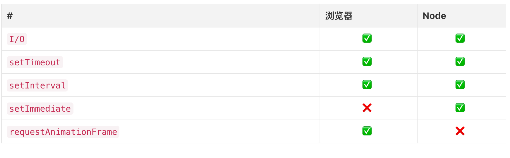

# 宏任务 微任务 与 Event-loop

## 浏览器中Event Loop

javascript有一个main thread 主线程和一个call-stack调用栈，所有的任务都会被放到调用栈等待主线程执行、

JS调用栈

js调用栈采用的是后进先出的规则，当函数执行的时候，会被添加到栈的顶部，当执行栈完成后，就会从栈顶移出，知道栈内被清空。

同步任务和异步任务：

javascript单线程任务被分为同步任务和异步任务，同步任务会在调用栈中按照执行顺序等待主线程依次执行， 异步任务会在异步任务有了结果之后，将注册的回调函数放入到任务队列中等待主线程空闲的时候，被读取到栈内等待主线程执行。


## 宏任务与微任务的区别

在当前微任务没有执行完成时，是不会执行下一个宏任务的

````javascript
setTimeout(_ => console.log(4))

new Promise((resolve, reject) => {
  resolve()
  console.log(1)
}).then(res => {
  console.log(3)
})

console.log(2)
// 1 2 3 4 
````
分析： `setTimeout`就是作为宏任务存在的，而`Promise.then`是典型的微任务；所有会进入的异步都是指的是回调中的那部分代码 
    也就是说，`new Promise` 在实例化的过程中执行的代码都是同步进行的，而`then`中注册的回调才是异步执行的
    在同步代码执行完成后才回去检查是否有异步任务完成，并执行对应的回调，而微任务又是在宏任务之前执行
    所以执行顺序是： new Promiese实例化中的同步代码`console.log(1)` -----> 同步代码`console.log(2)` ----> then注册的回调`console.log(3)`(微任务执行完成之前，宏任务不执行) ----> setTimeout宏任务`console.log(4)`


所以进阶，即使我们在Promise中实例化Promise ，其输出依然会早于`setTimeout`的宏任务

````javascript
setTimeout(_ => console.log(4))

new Promise((resolve) => {
  resolve()
  console.log(1)
}).then(res => {
  console.log(3)
  Promise.resolve().then(_ => {
    console.log('before timeout)
  }).then(resolve => {
    Promise.resolve().then(_ => {
      console.log('also before timeout')
    })
  })
})
console.log(2)
````
但是在实际情况中，一般不会直接调用Promise的，一般还有异步操作，比如：`fetch` `fs.readFile` 这就相当于注册一个宏任务，而不是微任务

宏任务：



微任务：


但从API上来看，Node新增了两个方法来使用，微任务的`process.nextTick` 以及宏任务的`setImmediate`


js执行机制：
> 执行一个宏任务，过程中，如果遇到微任务，就将其放到微任务的【事件队列】中
> 当前宏任务执行完毕之后，会查看微任务的【事件队列】 并将里面的全部微任务依次执行完


由于因为async await 本身就是promise+generator的语法糖。所以await后面的代码是microtask。所以对于本题中的

````javascript
async function async1() {
	console.log('async1 start');
	await async2();
	console.log('async1 end');
}
````
等价于

````javascript
async function async1() {
	console.log('async1 start');
	Promise.resolve(async2()).then(() => {
                console.log('async1 end');
        })
}
````